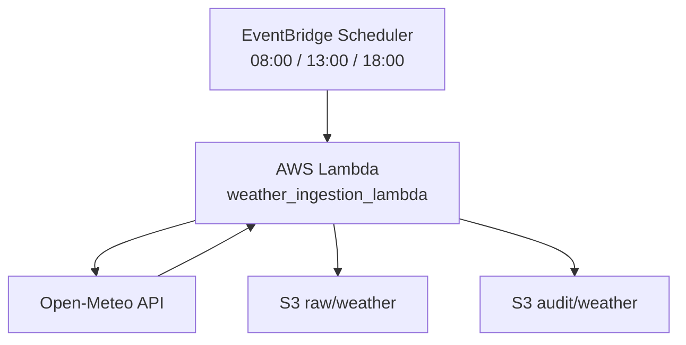

# ClimateWatch Colombia

Serverless weather ingestion pipeline for Colombian cities built on AWS.  
The project queries the Open-Meteo API, stores raw responses in Amazon S3, writes one audit file per run, and triggers the ingestion automatically three times per day with EventBridge Scheduler.

## Objective

Build a simple but real cloud data pipeline that demonstrates:

- ingestion from a public API
- multi-city processing
- partitioned storage in S3
- run-level audit logging
- serverless automation with AWS Lambda and EventBridge Scheduler

## Architecture

- **Source**: Open-Meteo API
- **Scheduling**: EventBridge Scheduler
- **Execution**: AWS Lambda
- **Storage**: Amazon S3
- **Current layers**:
  - `raw/weather/`
  - `audit/weather/`

## Diagram



If Mermaid is not rendered, the same flow looks like this:

```text
EventBridge Scheduler
        |
        v
AWS Lambda (weather_ingestion_lambda)
        |
        v
   Open-Meteo API
        |
        v
   S3 raw/weather
   S3 audit/weather
```

## Cities Monitored

- Bogota
- Barranquilla
- Medellin
- Cali

## Variables Collected

- `temperature_2m`
- `relative_humidity_2m`
- `precipitation_probability`
- `cloud_cover`
- `wind_speed_10m`

## Execution Frequency

The ingestion runs automatically every day at:

- 08:00
- 13:00
- 18:00

Timezone: `America/Bogota`

## S3 Storage Layout

### Raw

```text
raw/weather/year=YYYY/month=MM/day=DD/weather_<city>_<timestamp>.json
```

### Audit

```text
audit/weather/year=YYYY/month=MM/day=DD/weather_run_<timestamp>.json
```

## Pipeline Flow

1. EventBridge Scheduler triggers the Lambda function.
2. The Lambda reads the project configuration.
3. Open-Meteo is queried for each configured city.
4. One raw JSON file per city is stored in S3.
5. One audit JSON file is generated with the run summary.
6. The function returns basic execution metrics.

## Example Lambda Output

```json
{
  "run_timestamp": "20260421T192627",
  "bucket": "climatewatch-colombia-dev",
  "cities_attempted": 4,
  "cities_succeeded": 4,
  "cities_failed": 0,
  "audit_key": "audit/weather/year=2026/month=04/day=21/weather_run_20260421T192627.json"
}
```

## Project Structure

```text
ClimateWatch/
|-- config/
|   `-- sources.yaml
|-- data/
|   `-- .gitkeep
|-- experiments/
|   |-- experiment_01_inspect_sources_config.py
|   |-- experiment_02_validate_open_meteo_request.py
|   |-- experiment_03_save_single_city_weather_local.py
|   |-- experiment_04_save_all_cities_weather_local.py
|   |-- experiment_05_transform_raw_weather_to_curated_csv.py
|   `-- experiment_06_test_s3_upload.py
|-- src/
|   `-- ingestion/
|       `-- weather_ingestion_lambda.py
|-- .gitignore
|-- requirements-lambda.txt
|-- requirements.txt
`-- README.md
```

## Repository Guide

This section explains what each file is and why it exists in the project.

| Path | What it is | Why it was created |
| --- | --- | --- |
| `README.md` | Main project documentation | Explains the architecture, the scope of the project, and how the repository is organized for portfolio review. |
| `.gitignore` | Ignore rules for generated artifacts | Keeps the repository clean by excluding local data outputs, Python cache files, and Lambda packaging artifacts. |
| `requirements.txt` | Full local dependency list | Lets the project run locally, including exploratory scripts and the local transformation prototype. |
| `requirements-lambda.txt` | Lean dependency list for deployment packaging | Keeps the Lambda package focused on only the libraries needed by the serverless ingestion flow. |
| `config/sources.yaml` | Central project configuration | Stores cities, variables, timezone, schedule metadata, and API endpoint outside the code so the pipeline stays config-driven. |
| `src/ingestion/weather_ingestion_lambda.py` | Main serverless ingestion script | This is the Lambda-ready entry point that runs the production version of the raw and audit ingestion flow in AWS. |
| `data/.gitkeep` | Placeholder for a generated local data folder | Keeps the `data/` directory visible in the repo even though raw, curated, and audit outputs are intentionally ignored. |
| `experiments/experiment_01_inspect_sources_config.py` | Early YAML inspection prototype | Validated that the project could be driven from configuration before making any API calls. |
| `experiments/experiment_02_validate_open_meteo_request.py` | API request validation prototype | Confirmed that the request parameters were correct and that the response structure matched the expected hourly fields. |
| `experiments/experiment_03_save_single_city_weather_local.py` | First local raw-ingestion prototype | Proved that a single response could be saved as a partitioned local JSON file before scaling to multiple cities. |
| `experiments/experiment_04_save_all_cities_weather_local.py` | Multi-city local ingestion prototype | Introduced looping over all cities plus a local audit file to shape the ingestion logic before moving to S3. |
| `experiments/experiment_05_transform_raw_weather_to_curated_csv.py` | Local transformation prototype | Converts raw local JSON files into curated CSV outputs and adds validation checks for a future curated layer. |
| `experiments/experiment_06_test_s3_upload.py` | Minimal AWS connectivity test | Verified that local credentials and `boto3` access could write JSON objects to S3 before wiring the full Lambda pipeline. |

## Environment Variables

- `S3_BUCKET`: required bucket name used by the Lambda ingestion script
- `AWS_REGION`: optional AWS region, defaults to `us-east-1`
- `CONFIG_PATH`: optional override for the YAML configuration file location

## Technologies

- Python
- AWS Lambda
- Amazon S3
- Amazon EventBridge Scheduler
- Boto3
- Open-Meteo API
- YAML

## What I Learned

- the difference between running a script locally and running it as an AWS Lambda function
- how to use S3 as a raw and audit storage layer in the cloud
- how IAM permissions affect serverless data pipelines
- how to package dependencies for Lambda deployment
- how to automate ingestion jobs with EventBridge Scheduler
- how partitioning and timestamps improve observability and traceability

## Next Steps

- move the curated transformation layer to AWS
- add stronger data-quality validations
- build an analytical layer or simple dashboard on top of the ingested data
- replace broad IAM permissions with minimum required policies

## Notes

- Local raw, curated, and audit outputs are not versioned in the repository. They are generated when running the exploratory scripts.
- The main portfolio artifact is the Lambda ingestion flow in `src/ingestion/weather_ingestion_lambda.py`.
- The `experiments/` folder is intentionally kept to show the evolution from local prototypes to the cloud implementation.
