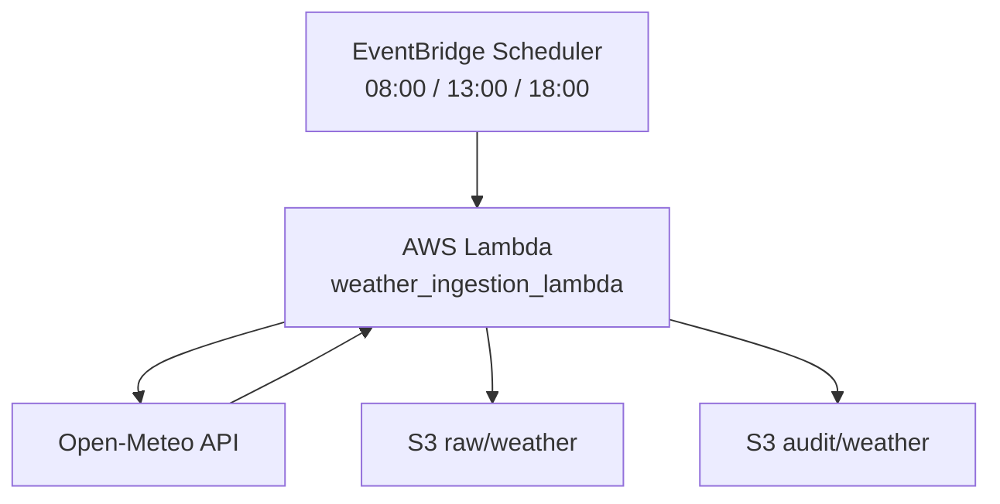

# ClimateWatch Colombia

Serverless weather ingestion pipeline for Colombian cities built on AWS.  
The project queries the Open-Meteo API, stores raw responses in Amazon S3, writes one audit file per run, and triggers the ingestion automatically three times per day with EventBridge Scheduler.

## Objective

Build a simple but real cloud data pipeline that demonstrates:

- ingestion from a public API
- multi-city processing
- partitioned storage in S3
- run-level audit logging
- serverless automation with AWS Lambda and EventBridge Scheduler

## Architecture

- **Source**: Open-Meteo API
- **Scheduling**: EventBridge Scheduler
- **Execution**: AWS Lambda
- **Storage**: Amazon S3
- **Current layers**:
  - `raw/weather/`
  - `curated/weather/`
  - `audit/weather/`
  - `audit/curated_weather/`

## Diagram



If Mermaid is not rendered, the same flow looks like this:

```text
EventBridge Scheduler
        |
        v
AWS Lambda (weather_ingestion_lambda)
        |
        v
   Open-Meteo API
        |
        v
   S3 raw/weather
   S3 audit/weather
```

## Cities Monitored

- Bogota
- Barranquilla
- Medellin
- Cali

## Variables Collected

- `temperature_2m`
- `relative_humidity_2m`
- `precipitation_probability`
- `cloud_cover`
- `wind_speed_10m`

## Execution Frequency

The ingestion runs automatically every day at:

- 08:00
- 13:00
- 18:00

Timezone: `America/Bogota`

## S3 Storage Layout

### Raw

```text
raw/weather/year=YYYY/month=MM/day=DD/weather_<city>_<timestamp>.json
```

### Audit

```text
audit/weather/year=YYYY/month=MM/day=DD/weather_run_<timestamp>.json
```

## Pipeline Flow

1. EventBridge Scheduler triggers the Lambda function.
2. The Lambda reads the project configuration.
3. Open-Meteo is queried for each configured city.
4. One raw JSON file per city is stored in S3.
5. One audit JSON file is generated with the run summary.
6. The function returns basic execution metrics.

## Example Lambda Output

```json
{
  "run_timestamp": "20260421T192627",
  "bucket": "climatewatch-colombia-dev",
  "cities_attempted": 4,
  "cities_succeeded": 4,
  "cities_failed": 0,
  "audit_key": "audit/weather/year=2026/month=04/day=21/weather_run_20260421T192627.json"
}
```

## Parte 2: Transformacion serverless a capa curated

### Descripcion

La segunda fase del proyecto mueve la transformacion de datos desde una prueba local a una arquitectura serverless en AWS.

En esta etapa, los archivos `raw` generados por la Lambda de ingestion son leidos desde Amazon S3, transformados a un formato tabular por hora y guardados como archivos CSV en una capa `curated`. Ademas, cada corrida genera un archivo de auditoria para trazabilidad del proceso.

### Objetivo

Convertir los archivos meteorologicos `raw` almacenados en S3 en una capa `curated` lista para analisis, evitando reprocesamientos innecesarios y manteniendo auditoria por corrida.

### Que hace esta fase

La Lambda de transformacion:

- lista los archivos `raw` disponibles en `raw/weather/`
- identifica cuales aun no tienen un archivo `curated` correspondiente
- lee cada JSON `raw` desde S3
- valida que el bloque `hourly` contenga las columnas esperadas
- transforma las listas paralelas del bloque `hourly` en filas tabulares
- genera un CSV por archivo `raw`
- guarda el resultado en `curated/weather/`
- genera un archivo de auditoria en `audit/curated_weather/`

### Logica de transformacion

Cada archivo `raw` contiene un bloque `hourly` con listas alineadas por indice, por ejemplo:

- `time`
- `temperature_2m`
- `relative_humidity_2m`
- `precipitation_probability`
- `cloud_cover`
- `wind_speed_10m`

La transformacion convierte esas listas en una estructura tabular con una fila por hora.

### Columnas del dataset curated

Cada fila del CSV `curated` contiene:

- `city`
- `ingestion_timestamp`
- `time`
- `temperature_2m`
- `relative_humidity_2m`
- `precipitation_probability`
- `cloud_cover`
- `wind_speed_10m`

#### Significado de columnas clave

- `city`: ciudad asociada al archivo raw procesado
- `ingestion_timestamp`: timestamp de la corrida de ingestion que genero el raw
- `time`: timestamp horario del forecast meteorologico

### Validaciones implementadas

Antes de escribir el archivo `curated`, la Lambda valida:

- que exista el bloque `hourly`
- que esten presentes todas las columnas esperadas
- que todas las listas del bloque `hourly` tengan la misma longitud
- que el archivo `curated` no exista previamente, para evitar reprocesamiento

### Estrategia incremental

La transformacion fue disenada como un proceso incremental.

Para cada archivo `raw`, la Lambda calcula cual deberia ser su archivo `curated` correspondiente. Si ese archivo ya existe en S3, el archivo se marca como `skipped`. Si no existe, se transforma y se guarda.

Esto permite que la Lambda procese unicamente archivos pendientes y mantenga una logica idempotente basica.

### Estructura en S3

#### Raw

```text
raw/weather/year=YYYY/month=MM/day=DD/weather_<city>_<timestamp>.json
```

#### Curated

```text
curated/weather/year=YYYY/month=MM/day=DD/weather_curated_<city>_<timestamp>.csv
```

#### Audit de transformacion

```text
audit/curated_weather/year=YYYY/month=MM/day=DD/curated_weather_run_<timestamp>.json
```

### Variables de entorno de la Lambda de transformacion

La funcion `weather_transform_lambda` usa estas variables de entorno:

- `S3_BUCKET`
- `RAW_PREFIX`
- `CURATED_PREFIX`
- `CURATED_AUDIT_PREFIX`

Valores usados en esta version:

```text
S3_BUCKET=climatewatch-colombia-dev
RAW_PREFIX=raw/weather/
CURATED_PREFIX=curated/weather/
CURATED_AUDIT_PREFIX=audit/curated_weather/
```

### Archivo principal

La logica de esta fase vive en:

```text
src/transformation/weather_transform_lambda.py
```

### Funciones principales

#### `get_all_raw_keys()`

Lista todos los archivos JSON disponibles en la capa `raw/weather/`.

#### `parse_weather_file_name_from_key(raw_key)`

Extrae `city_slug` y `timestamp` desde el nombre del archivo raw.

#### `get_curated_output_key(raw_key)`

Construye la key esperada del archivo `curated` correspondiente.

#### `s3_key_exists(key)`

Verifica si un objeto ya existe en S3 para evitar reprocesamiento.

#### `transform_raw_object(raw_key, curated_key)`

Lee un raw desde S3, valida su estructura, transforma el bloque `hourly` a CSV y sube el resultado a S3.

#### `save_transform_audit_report(run_timestamp, raw_files_found, results)`

Guarda el resumen de la corrida de transformacion en la capa de auditoria.

#### `run_transformation()`

Orquesta todo el flujo:

- lista raws
- determina pendientes
- transforma
- guarda auditoria
- devuelve resumen final

#### `lambda_handler(event, context)`

Punto de entrada para AWS Lambda.

### Automatizacion

La Lambda de transformacion se ejecuta automaticamente con EventBridge Scheduler en zona horaria `America/Bogota`.

Horarios configurados:

- 08:05
- 13:05
- 18:05

Esto permite que la transformacion corra pocos minutos despues de la Lambda de ingestion.

### Resultado esperado de una corrida

Ejemplo de respuesta de la Lambda:

```json
{
  "run_timestamp": "20260422T041316",
  "bucket": "climatewatch-colombia-dev",
  "raw_files_found": 12,
  "files_transformed": 12,
  "files_skipped": 0,
  "files_failed": 0,
  "audit_key": "audit/curated_weather/year=2026/month=04/day=22/curated_weather_run_20260422T041316.json"
}
```

### Decisiones de diseno

En esta fase no se uso `pandas` dentro de Lambda.

La transformacion se implemento con librerias estandar de Python (`csv`, `io`, `json`) para:

- simplificar el empaquetado
- reducir dependencias
- hacer la Lambda mas liviana
- evitar problemas innecesarios de despliegue

### Aprendizajes de esta fase

- como leer objetos desde S3 dentro de Lambda
- como disenar una transformacion incremental en cloud
- como construir una capa `curated` sin depender de pandas
- como usar auditoria por corrida para trazabilidad
- como separar capas `raw`, `curated` y `audit` en S3
- como automatizar ingestion y transformacion con Lambdas separadas

### Resumen corto para el repo

La segunda fase del proyecto implementa una transformacion serverless en AWS que toma archivos `raw` meteorologicos desde S3, los convierte en archivos tabulares `curated` por hora, evita reprocesamiento innecesario y genera auditoria por corrida. Esta fase completa la base del pipeline end-to-end junto con la Lambda de ingestion.

## Project Structure

```text
ClimateWatch/
|-- config/
|   `-- sources.yaml
|-- data/
|   `-- .gitkeep
|-- experiments/
|   |-- experiment_01_inspect_sources_config.py
|   |-- experiment_02_validate_open_meteo_request.py
|   |-- experiment_03_save_single_city_weather_local.py
|   |-- experiment_04_save_all_cities_weather_local.py
|   |-- experiment_05_transform_raw_weather_to_curated_csv.py
|   `-- experiment_06_test_s3_upload.py
|-- src/
|   |-- ingestion/
|   |   `-- weather_ingestion_lambda.py
|   `-- transformation/
|       `-- weather_transform_lambda.py
|-- .gitignore
|-- requirements-lambda.txt
|-- requirements.txt
`-- README.md
```

## Repository Guide

This section explains what each file is and why it exists in the project.

| Path | What it is | Why it was created |
| --- | --- | --- |
| `README.md` | Main project documentation | Explains the architecture, the scope of the project, and how the repository is organized for portfolio review. |
| `.gitignore` | Ignore rules for generated artifacts | Keeps the repository clean by excluding local data outputs, Python cache files, and Lambda packaging artifacts. |
| `requirements.txt` | Full local dependency list | Lets the project run locally, including exploratory scripts and the local transformation prototype. |
| `requirements-lambda.txt` | Lean dependency list for deployment packaging | Keeps the Lambda package focused on only the libraries needed by the serverless ingestion flow. |
| `config/sources.yaml` | Central project configuration | Stores cities, variables, timezone, schedule metadata, and API endpoint outside the code so the pipeline stays config-driven. |
| `src/ingestion/weather_ingestion_lambda.py` | Main serverless ingestion script | This is the Lambda-ready entry point that runs the production version of the raw and audit ingestion flow in AWS. |
| `data/.gitkeep` | Placeholder for a generated local data folder | Keeps the `data/` directory visible in the repo even though raw, curated, and audit outputs are intentionally ignored. |
| `experiments/experiment_01_inspect_sources_config.py` | Early YAML inspection prototype | Validated that the project could be driven from configuration before making any API calls. |
| `experiments/experiment_02_validate_open_meteo_request.py` | API request validation prototype | Confirmed that the request parameters were correct and that the response structure matched the expected hourly fields. |
| `experiments/experiment_03_save_single_city_weather_local.py` | First local raw-ingestion prototype | Proved that a single response could be saved as a partitioned local JSON file before scaling to multiple cities. |
| `experiments/experiment_04_save_all_cities_weather_local.py` | Multi-city local ingestion prototype | Introduced looping over all cities plus a local audit file to shape the ingestion logic before moving to S3. |
| `experiments/experiment_05_transform_raw_weather_to_curated_csv.py` | Local transformation prototype | Converts raw local JSON files into curated CSV outputs and adds validation checks for a future curated layer. |
| `experiments/experiment_06_test_s3_upload.py` | Minimal AWS connectivity test | Verified that local credentials and `boto3` access could write JSON objects to S3 before wiring the full Lambda pipeline. |

## Environment Variables

- `S3_BUCKET`: required bucket name used by the Lambda ingestion script
- `AWS_REGION`: optional AWS region, defaults to `us-east-1`
- `CONFIG_PATH`: optional override for the YAML configuration file location

## Technologies

- Python
- AWS Lambda
- Amazon S3
- Amazon EventBridge Scheduler
- Boto3
- Open-Meteo API
- YAML

## What I Learned

- the difference between running a script locally and running it as an AWS Lambda function
- how to use S3 as a raw and audit storage layer in the cloud
- how IAM permissions affect serverless data pipelines
- how to package dependencies for Lambda deployment
- how to automate ingestion jobs with EventBridge Scheduler
- how partitioning and timestamps improve observability and traceability

## Next Steps

- replace broad IAM permissions with minimum required policies
- create an analytical layer that combines weather and air-quality data
- build a dashboard or demo visualization on top of `curated/weather/`
- add alerts and monitoring for transformation and ingestion failures
- extend the pipeline with new data sources

## Notes

- Local raw, curated, and audit outputs are not versioned in the repository. They are generated when running the exploratory scripts.
- The main portfolio artifact is the Lambda ingestion flow in `src/ingestion/weather_ingestion_lambda.py`.
- The `experiments/` folder is intentionally kept to show the evolution from local prototypes to the cloud implementation.
